# Setup Login

ADB無しでチャレンジパッドにアプリをインストールします。

## 使用方法

1. [test_environment_info.xml](test_environment_info.xml?raw=true) をダウンロードします。
2. 例）名前を付けて保存を押します。
[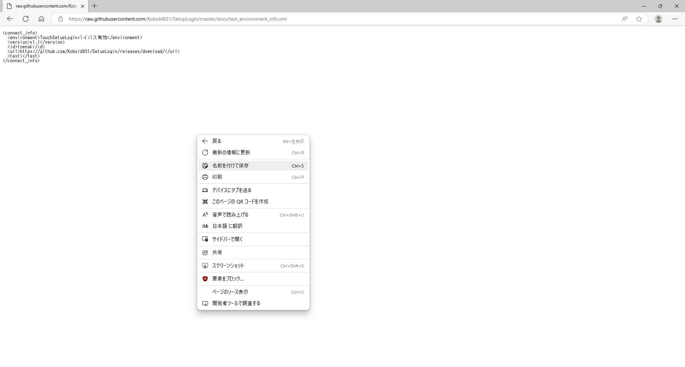](#)
2. 例）保存を押します。 
[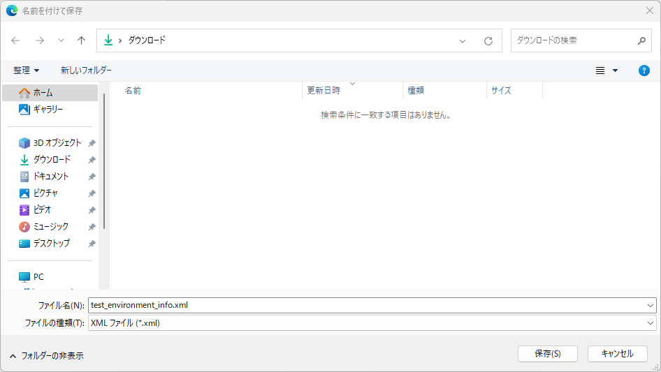](#)
2. 例）test_environment_info.xml があることを確認します。
[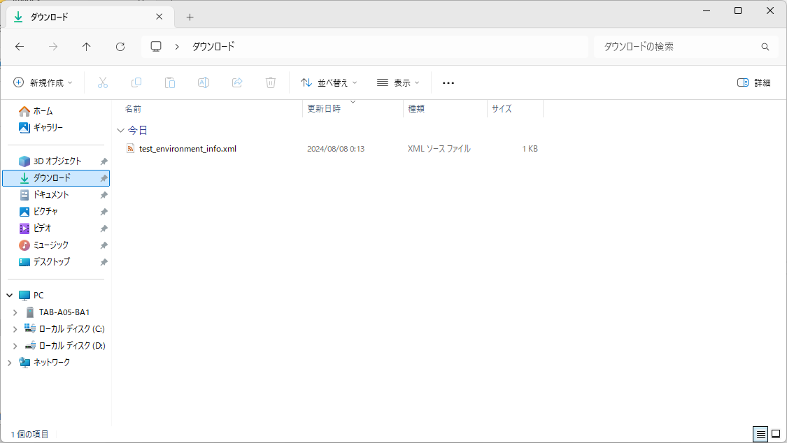](#)
2. 空ファイルではないこと、不要な文字や改行などが含まれていないことを確認してください。
[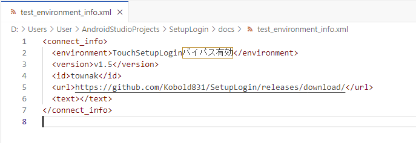](#)
3.test_environment_info.xml をSDカードのルート(最上位)ディレクトリにコピーします。
[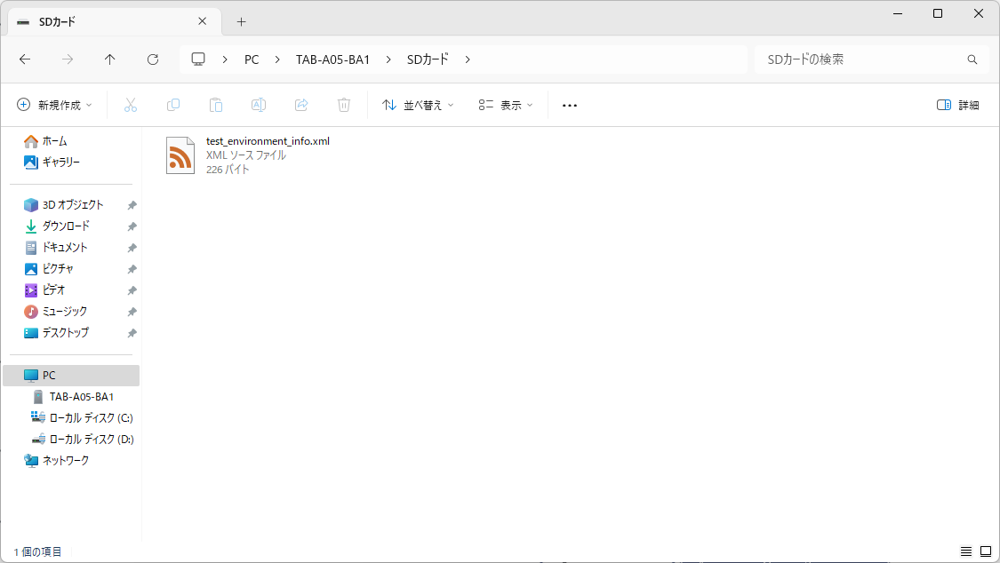](#)
2. SDカードをチャレンジパッドに挿入します。
3. ホーム画面の \[**まず　最初に　押そう！**\] を押します。
[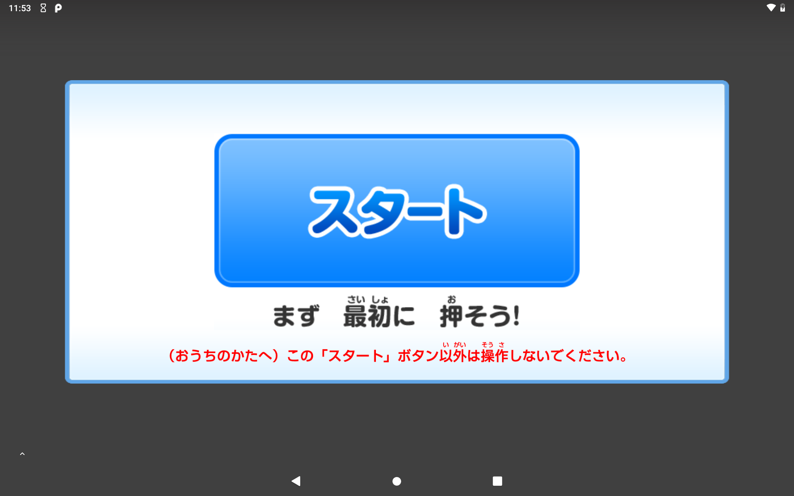](#)
4. \[**わかった**\] を押します。
[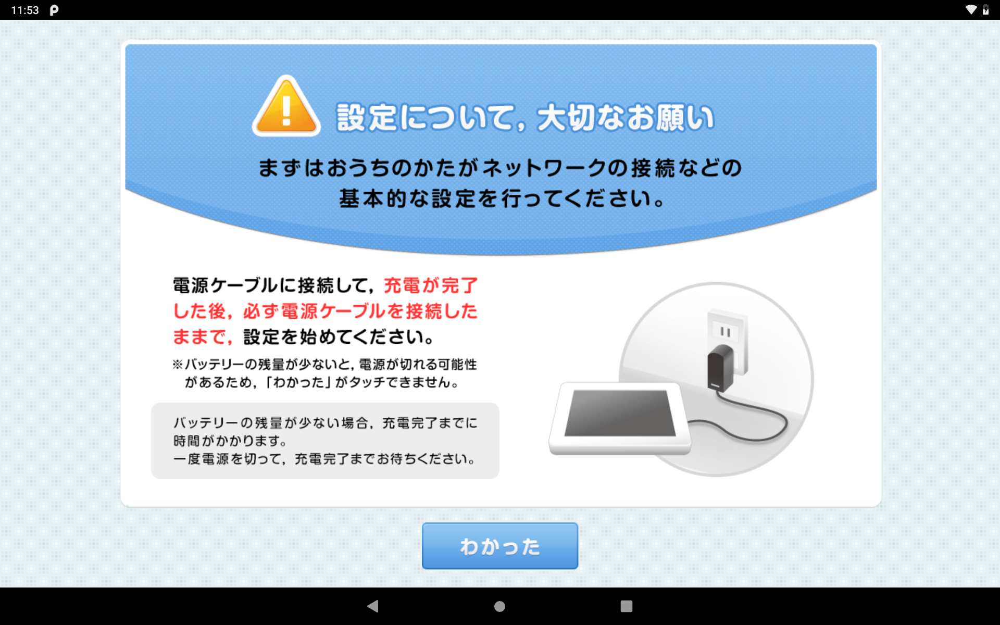](#)
4. このタイミングで画面右下に文字が表示されていることを確認します。確認できたら設定を始めるを押します。
[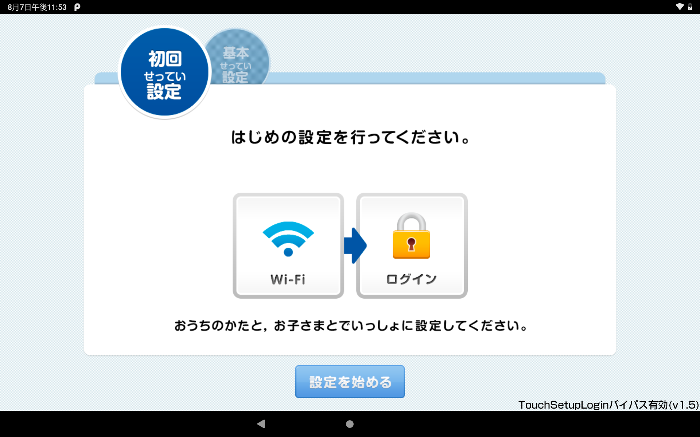](#)
4. 次へを押します。
[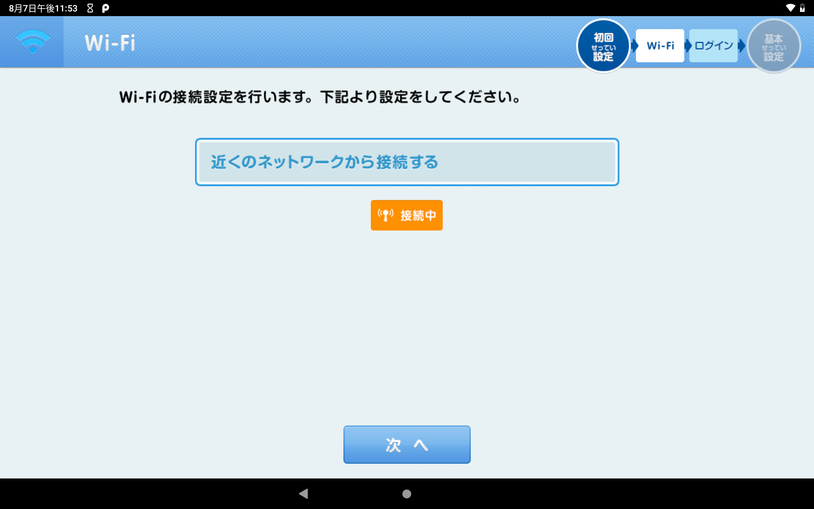](#)
4. 次へを押します。
[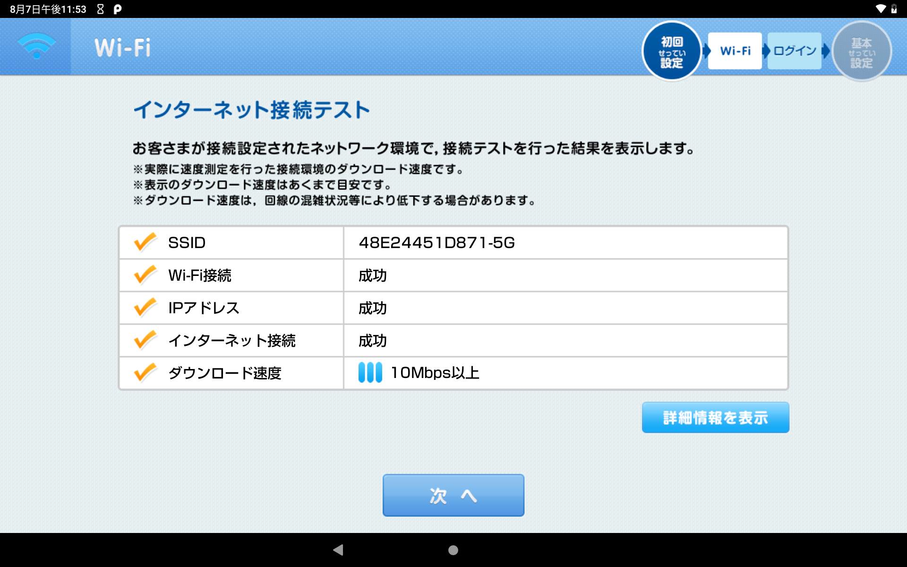](#)
4. しばらく待ちます。
[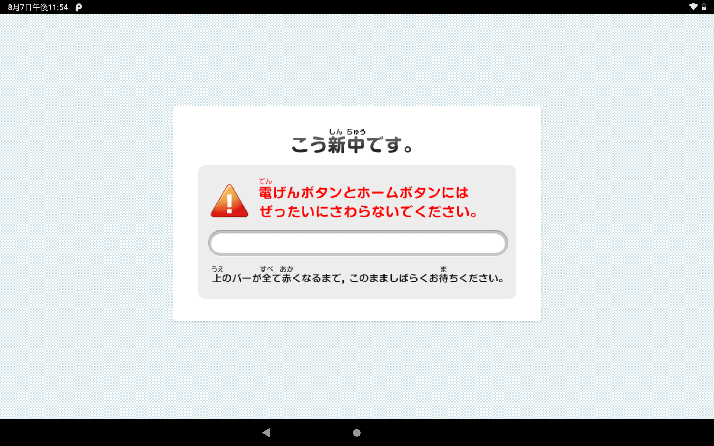](#)
4. この画面が表示されることを確認します。
[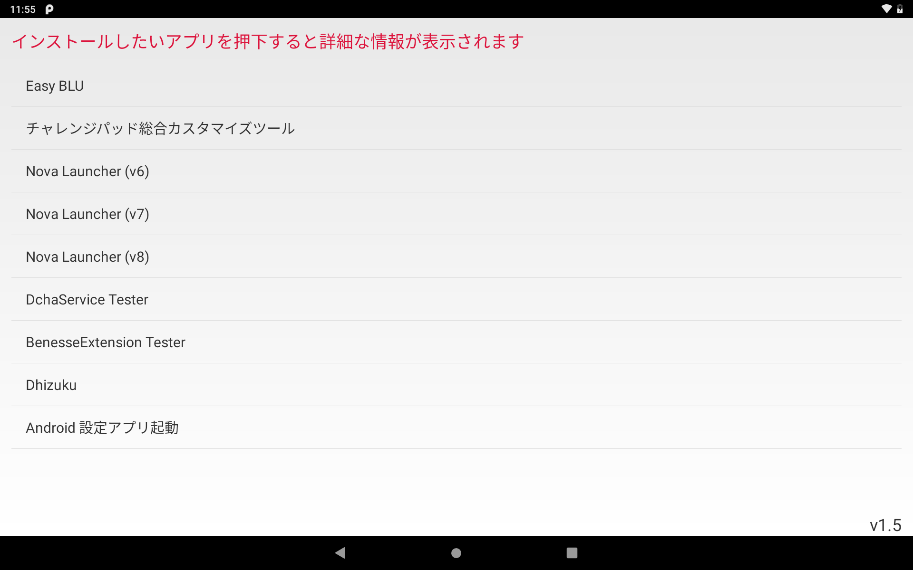](#)
5. 表示されたリストからアプリを選択してOKを押します。
6. しばらくするとアプリが起動します。

## 問題の報告

予期せぬ動作、クラッシュ、不具合などが発生している場合、または新機能、改善、提案などがある場合は [Google フォームから報告](https://forms.gle/MpHrdsMMqx9UiqsG9) できます。
