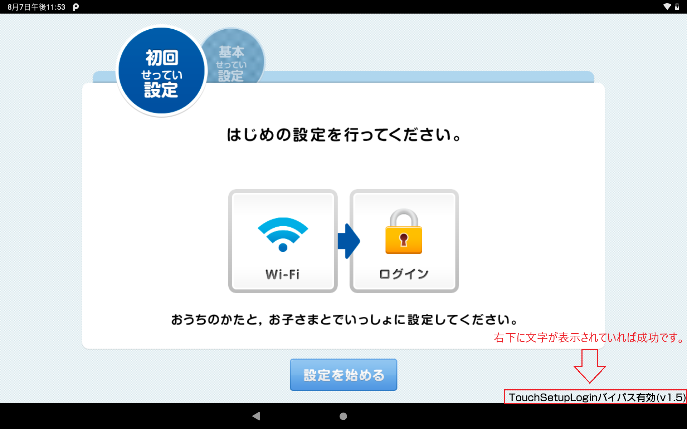

# Setup Login

**microSDカードのみ**で **チャレンジパッド** にアプリをインストールします。

> [!WARNING]
> チャレンジパッド２ の古いバージョンでは使用できない可能性があります。  
> これは、このアプリのインストール時にベネッセが許可した署名であるかどうかの検証が行われるためです。

## 要件

- 初期化直後のチャレンジパッド２、３、Neo、Next
- microSDカード
- microSDカードに書き込み出来る PC または スマートフォン等  
  ※差し込み口がない場合は、microSDカードリーダーが必要です。

## 使用方法

1. 以下の青いリンクを右クリックし、\[**名前を付けて(リンク先を)保存**\]を押します。  
  [**test_environment_info.xml**](test_environment_info.xml?raw=true)
1. \[**保存 (S)**\]を押します。
1. ファイルを開き、空ファイルでない事を確認してください。  
  
1. PC に microSDカード を挿入し、`test_environment_info.xml` をSDカードの**ルート(最上位)ディレクトリ**にコピーします。  
  
1. **microSDカード を チャレンジパッド に挿入します。**  
1. ホーム画面の \[**まず　最初に　押そう！**\] を押します。  
  
1. \[**わかった**\] を押します。  
    
  この際、**バッテリー残量が 50% 以上かつ充電中**でないと先に進めません。  
1. **この画面で右下に文字が表示されていることを確認します。**  
  確認できたら \[**設定を始める**\] を押します。
  
1. Wi-Fi に接続した後、\[**次へ**\] を押します。  
  
1. ｢**ダウンロード速度**｣が出たら、\[**次へ**\] を押します。
  
1. 指示通り端末に触れずに待機します。  
  
1. ログイン画面ではなく、アプリ一覧が表示されることを確認します。
  
1. アプリを選択して`OK`を押します。  
  この際、状況に応じて、次のいずれかのアプリを選択してください：
    - **Easy BLU**
    - **チャレンジパッド総合カスタマイズツール**
    - **Nova Launcher**
      - CT2/3: v5, v6  
        v6 の場合、設定アクティビティが開けない場合があります。
      - CTX/Z: v7, v8

---

## 問題の報告
予期せぬ動作、クラッシュ、不具合などが発生している場合は、バグレポートをお願いします。  
新機能、改善、提案などがある場合は、フィードバックをお願いします。  
↓  
[Google フォームから報告](https://forms.gle/MpHrdsMMqx9UiqsG9)
